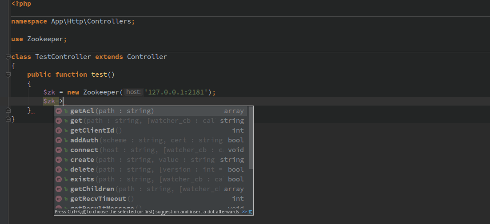
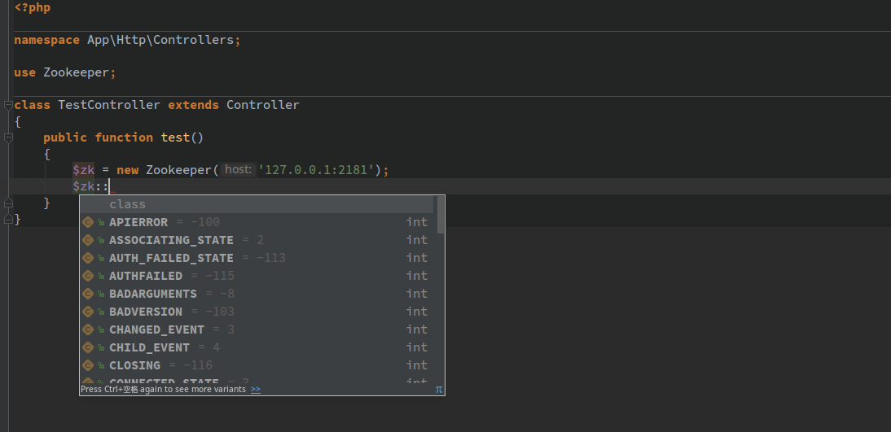

## php-zookeeper-ide-helper
[php-zookeeper](https://github.com/andreiz/php-zookeeper) extension ide helper

## Usage
### composer
```
composer require --dev liron-li/php-zookeeper-ide-helper
```

## Demo screenshots：


